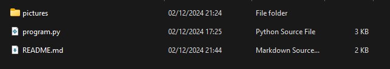

# Program Pengelolaan Data Mahasiswa
  
Program ini adalah aplikasi Python sederhana untuk mengelola daftar nilai mahasiswa. Program ini memiliki fitur untuk menambah data, menampilkan data, menghapus data berdasarkan nama, dan mengubah data berdasarkan nama. Semua fitur dikemas dalam menu interaktif yang mudah digunakan.

## Fitur Program
### 1. Tambah data Mahasiswa
  
* Pengguna dapat menambahkan data mahasiswa baru dengan memasukkan nama dan nilai.
* Jika nama mahasiswa sudah ada, program akan memberikan peringatan.  

### 2. Tampilkan data Mahasiswa
  
* Menampilkan semua data mahasiswa yang telah ditambahkan.
* Jika tidak ada data, program akan menampilkan pesan bahwa daftar masih kosong.   

### 3. Hapus data Mahasiswa
  
* Menghapus data mahasiswa berdasarkan nama.
* Jika nama tidak ditemukan, program akan memberikan pesan error.  

### 4. Ubah data Mahasiswa
  
* Mengubah nilai mahasiswa berdasarkan nama.
* Jika nama tidak ditemukan, program akan memberikan pesan error.  

### 5. Keluar dari Program
  
* Menghentikan Program.  

## Cara menggunakan Program
  
1. Pastikan Python sudah terinstal di perangkat Anda.
2. Unduh atau clone repository ini.
3. Jalankan file program di terminal atau IDE Python Anda.
4. Pilih opsi dari menu interaktif:
    * Masukkan angka untuk memilih menu yang diinginkan.
    * Ikuti petunjuk untuk memasukkan nama dan nilai mahasiswa.

## Contoh Tampilan Menu
  

## Alur Program
1. Program akan terus berjalan hingga pengguna memilih opsi Keluar (5).
2. Data mahasiswa disimpan dalam dictionary Python selama runtime.
3. Operasi seperti menambah, menghapus, dan mengubah data dilakukan dengan memanipulasi dictionary tersebut.

## Teknologi yang Digunakan
* Python: Versi 3.6 atau lebih baru.

# Thank You